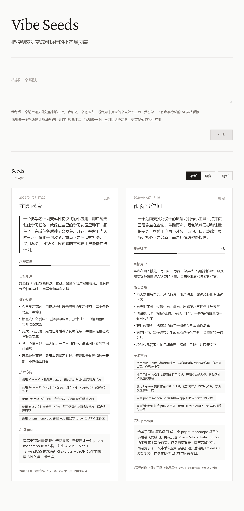

# Vibe Seeds

把模糊感觉变成可执行的小产品灵感。

## 截图



## 技术栈

- pnpm monorepo
- Vue 3 + Vite + TailwindCSS
- Express + TypeScript
- 单文件 JSON 存储：`data/seeds.json`
- 共享类型：`packages/shared`
- 灵感强度评分：每个 seed 会根据输入长度、情绪词、技术词和创意词生成 `score`，范围 1-100

## 安装

```bash
pnpm install
```

## 环境变量

后端会读取项目根目录的 `.env`。先复制示例文件：

```bash
cp .env.example .env
```

然后编辑 `.env`：

```env
AI_API_BASE_URL=https://api.openai.com/v1
AI_API_KEY=你的 key
AI_MODEL=你的模型名
AI_TEMPERATURE=1
AI_TIMEOUT_MS=120000
AI_ENABLE_FALLBACK=false
```

变量说明：

- `AI_API_BASE_URL`：OpenAI-compatible API 根地址，后端会请求 `${AI_API_BASE_URL}/chat/completions`
- `AI_API_KEY`：服务端调用 AI 的 API key，只能放在后端 `.env`，不要放到前端代码里
- `AI_MODEL`：要使用的模型名
- `AI_TEMPERATURE`：生成随机性，默认 `1`
- `AI_TIMEOUT_MS`：AI 请求超时时间，默认 `120000`
- `AI_ENABLE_FALLBACK`：AI 失败时是否启用本地规则兜底；`true` 时返回 `source: "fallback"`，`false` 时返回 502

如果使用其他兼容 `/v1/chat/completions` 的服务，只需要修改 `AI_API_BASE_URL` 和 `AI_MODEL`，API key 仍然只保存在后端 `.env`。

## 开发

```bash
pnpm dev
```

- Web: http://localhost:5173
- API: http://localhost:3001
- Vite 会把 `/api` 代理到 `http://localhost:3001`

## 构建

```bash
pnpm build
```

## 类型检查

```bash
pnpm typecheck
```

## API

- `GET /api/health`：健康检查
- `GET /api/seeds`：获取所有 seed
- `POST /api/seeds`：调用 OpenAI-compatible Chat Completions 生成 seed，请求体：

```json
{
  "vibe": "我想做一个适合周末、低压力、有点赛博感的个人效率工具。"
}
```

- `DELETE /api/seeds/:id`：删除 seed

## 功能

- 输入一句模糊的 vibe，生成结构化灵感种子卡片
- 每张卡片包含项目名称、概念、目标用户、核心功能、技术方向、后续 prompt、标签、创建时间和灵感强度
- seed 会标记 `source`：`"ai"` 表示 AI 生成，`"fallback"` 表示本地兜底规则生成
- 灵感强度 `score` 会根据输入长度、情绪词、技术词和创意词简单计算
- 前端支持按创建时间或灵感强度排序
- 支持删除 seed，数据持续保存在 `data/seeds.json`

## 目录结构

```text
vibe-seeds/
  apps/
    web/
    api/
  packages/
    shared/
  data/
    seeds.json
  pnpm-workspace.yaml
  package.json
  README.md
```

## 许可证

[LICENSE](./LICENSE)